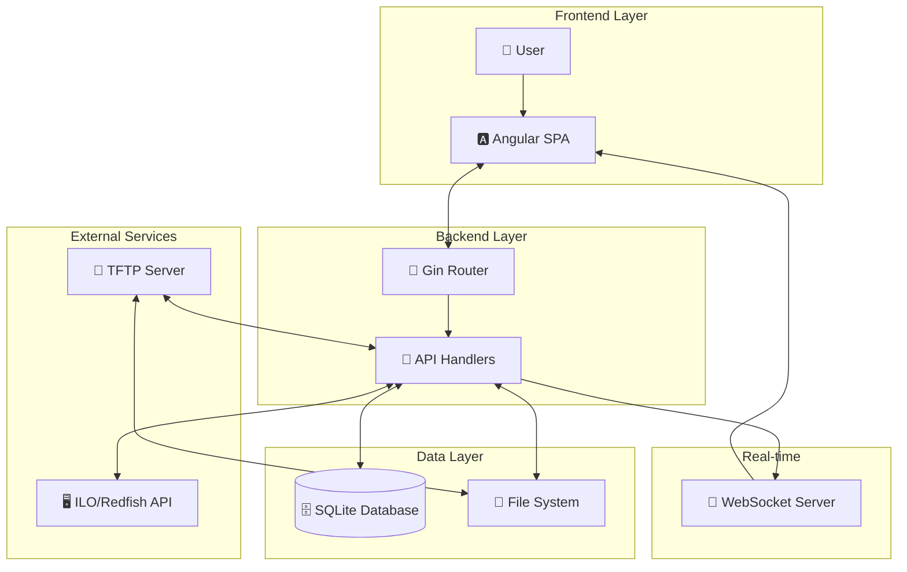
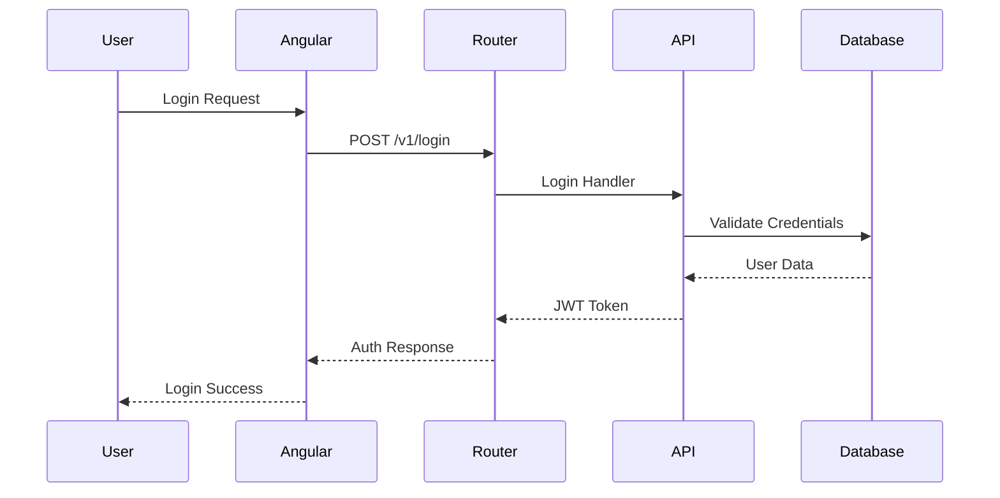
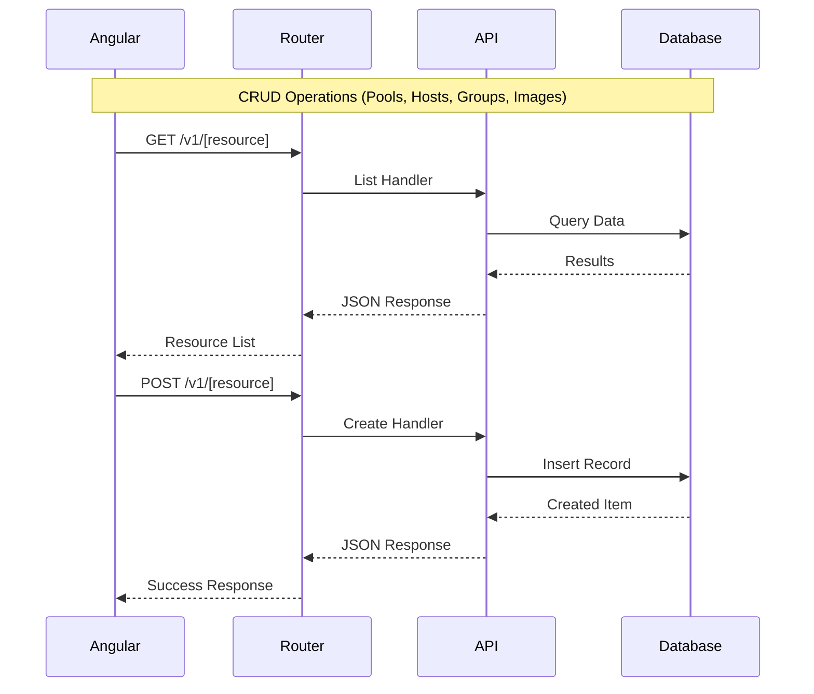
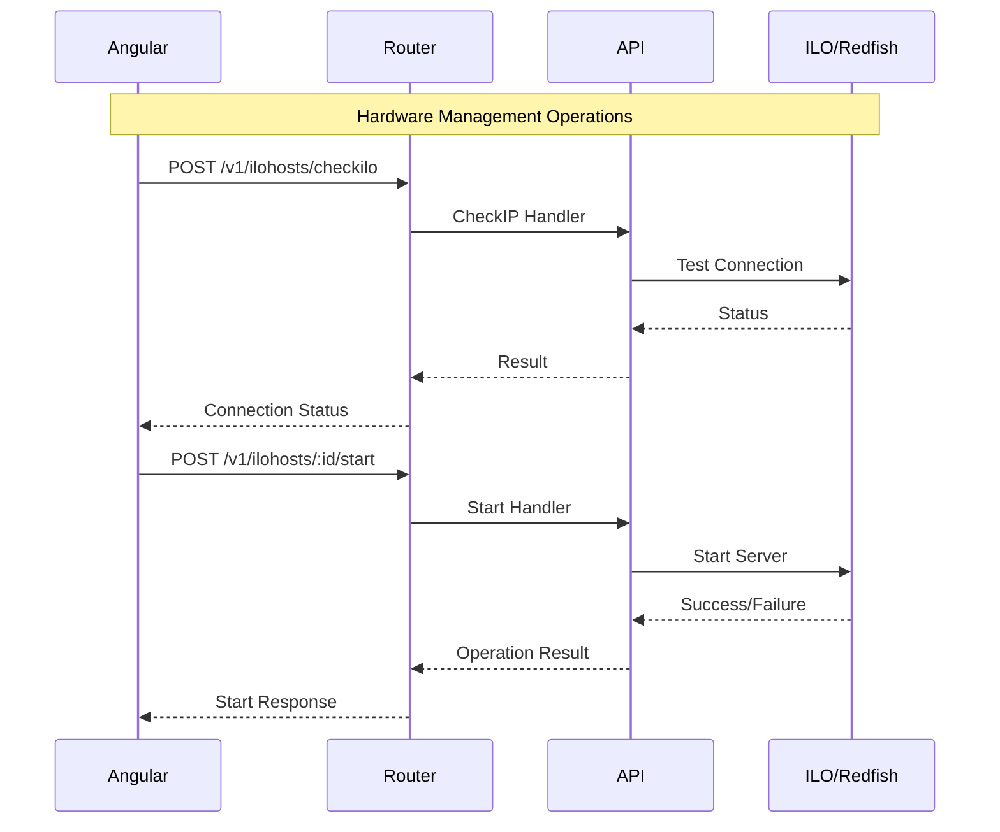
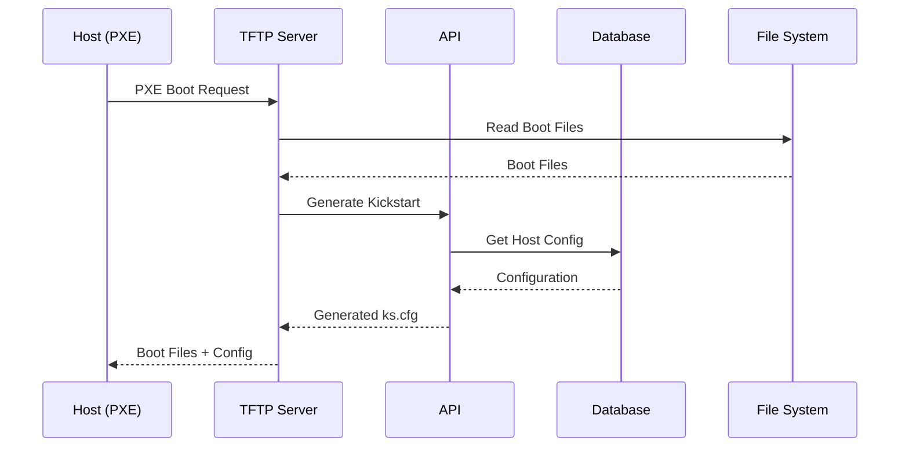
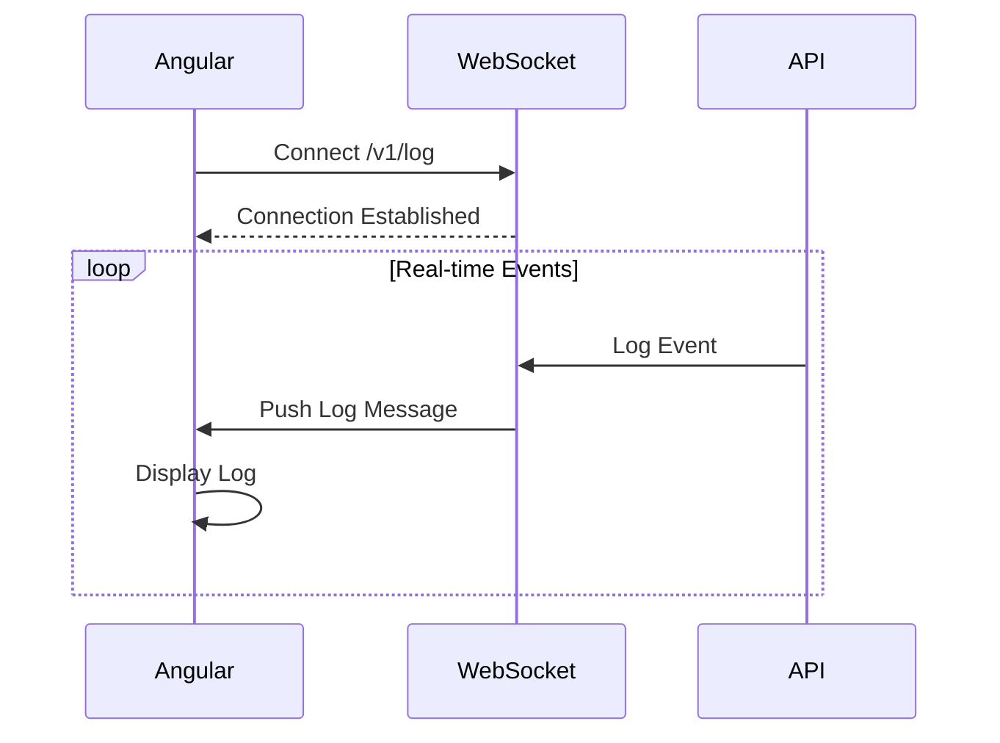

# go-via Communication Diagram

This diagram shows the communication flow between components in the go-via VMware imaging appliance.

## System Overview

## Main Communication Flows

### 1. User Authentication Flow

### 2. Resource Management Flow

### 3. Host Management & ILO Operations

### 4. Boot Process via TFTP

### 5. Real-time Logging

## API Endpoints Overview

### Core Resources
- **Authentication**: `/v1/login`
- **Pools**: `/v1/pools` (GET, POST, PATCH, DELETE)
- **Hosts**: `/v1/hosts` (GET, POST, PATCH, DELETE)
- **Groups**: `/v1/groups` (GET, POST, PATCH, DELETE)
- **Images**: `/v1/images` (GET, POST, DELETE)
- **Users**: `/v1/users` (GET, POST, PATCH, DELETE)

### Hardware Management
- **ILO Check**: `/v1/ilohosts/checkilo`
- **Host Control**: `/v1/ilohosts/:id/{start,shutdown,reboot}`
- **Boot Config**: `/v1/ilohosts/:id/{onetimeboot,setvlanID}`
- **Host Config**: `/v1/hostconfig`

### System Services
- **Theme**: `/v1/theme/image`
- **Logs**: `/v1/log` (WebSocket)
- **Version**: `/v1/version`
- **Kickstart**: `/ks.cfg`

## Component Responsibilities

### Frontend (Angular)
- **User Interface**: Forms, wizards, management screens
- **State Management**: Application state and routing
- **API Communication**: HTTP client for REST operations
- **Real-time Updates**: WebSocket connection for logs

### Backend (Go)
- **HTTP Server**: Gin router with middleware
- **Business Logic**: API handlers for all operations
- **Data Persistence**: SQLite database with GORM
- **File Management**: Static files and uploads
- **Hardware Integration**: ILO/Redfish API communication
- **Network Services**: TFTP server for boot files

### External Integrations
- **ILO/Redfish APIs**: Server hardware management
- **File System**: Boot images and configuration files
- **SQLite Database**: Application data storage
- **WebSocket**: Real-time event streaming
